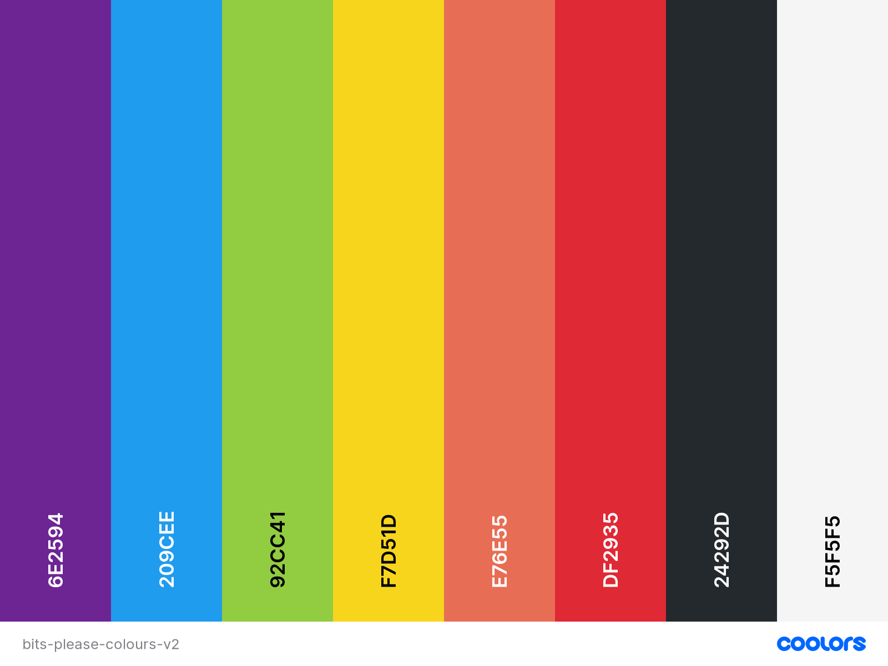

# List of Changes

## Visuals

### Theme

To further reinforce our retro-arcade theme, we went for a visual style that is pixilated. From our research we chose to display most content in their own separate "blocks", as can be seen on many retro games. As neon patterns were not commonly seen in retro games, we chose to move away from the neon-light theme.

### Layout

As, generally, most arcade gaming systems had square screens, we changed from having rounded corners to square corners for borders, images, and containers.

On the landing page, users are presented with a menu that aims to represent the look and function of a game menu. Navigation between pages can be done from either the home (landing) page, or with simple back buttons present on each page. Once again, this design choice was inspired by minimal options in terms of interactivity in arcade games.

### Colours & Fonts

Keeping with the retro theme, fonts were chosen that display pixilated. The fonts we chose were *Press Start 2P* for all headings, and *Serif Pixel* for body text. *Press Start* was chosen for headings as the font proved to be somewhat difficult to read in large quantities, something that *Serif Pixel* does not suffer from.

#### Updated Colour Pallete

For the colour palette, we chose a colour scheme that better represents the most common colours seen in old game menus.

The dark grey was used for the background, with off-white text. These colours where chosen over pure black and white as they have less contrast, and therefore provides better accesibility.

Blue was used as a primary colour for headings, and more importantly buttons. Secondary buttons are coloured with the same off-white colour, but with dark text colours.

Though the website mainly features the dark-grey and off-white colours, the remaining colours in the pallette were used across different pages to reinforce their use on the webpage. To improve the recognisability of each page and its content, the main page headings for the separate pages (accessed from the landing page) are synced with the colour for the relevant button on the home page.

## Page Specific Changes

### Home

To reinforce the arcade theme and add to the liveliness of the website, a simple animation was added to the background. We chose this specific animation as it isn't too distracting while still giving the desired effect.

The existing neon hover animations were swapped out for more subtle hover effects that suits the overarching theme better.

### Projects

Projects are displayed in the same grid format as can be seen on the *Shop* page to keep the styling consistent. Options for each item functions as radio buttons, relying on the sense of familiarity of the user. To indicate which option is selected, a terminal-style icon will blink.

### Shop

In our intial designs we used cards to display the available items for sale. This structure was kept, however, the images for each item is now displayed above the card information as opposed to being positioned to the left. This was done to improve the visual aesthetics and flow of information on the page.

Text was aligned to the left, making the content easier to read. To reinforce a hierarchy of importance on each card, sizing of text (specifically headings) was adjusted. Colour accents was also introduced to further help this.

### About Us

This page was not implemented for the first meeting, so there is no changes.

### Our Team

For the *Our Team* page, the content was kept more-or-less the same. The first change we made was to have the position of the images of each person alternate between left-aligned and right-aligned. This creates a different visual balance, and enhances the feel of the webpage.

The icons present for the social links for each person was initially in a modern clean svg style. This was changed to be pixelated to fit in with the overarching look and feel of the website.

For the list of skills, we wanted to represent the information in a more visual way. Thus, we chose to keep with the game feel and use progress bars for each of the skills. This provides the user with visual information that should be easier to interperet and read.

We also made use of speech bubbles on the Our Team page similar to how characters in game would talk which further enhances the overarching theme.

### Contact Us

To improve the user feedback, the error messages were specifically chosen to minimise the chance of the user feeling imtimidated by the interface. Feedback is given only when the input is invalid, and will immediately update as the user types.